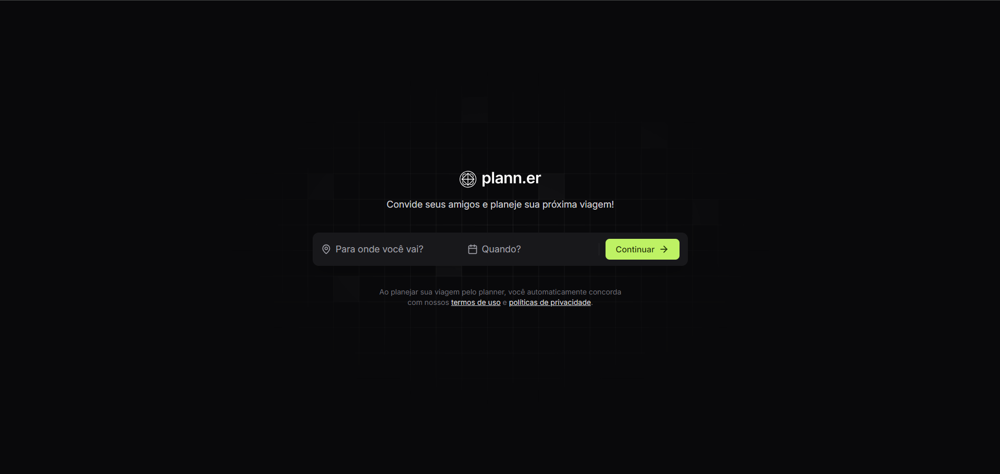
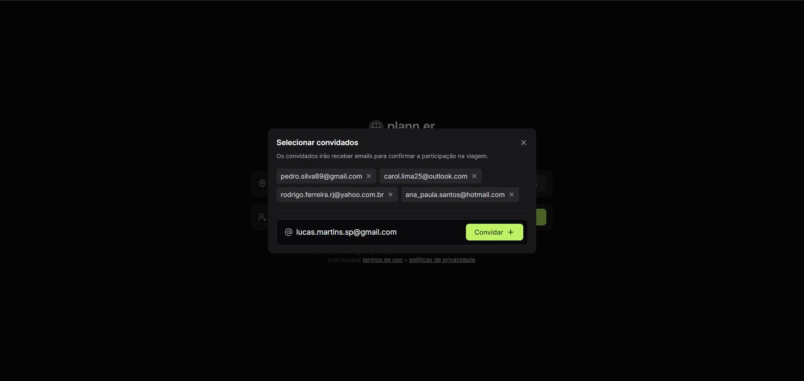
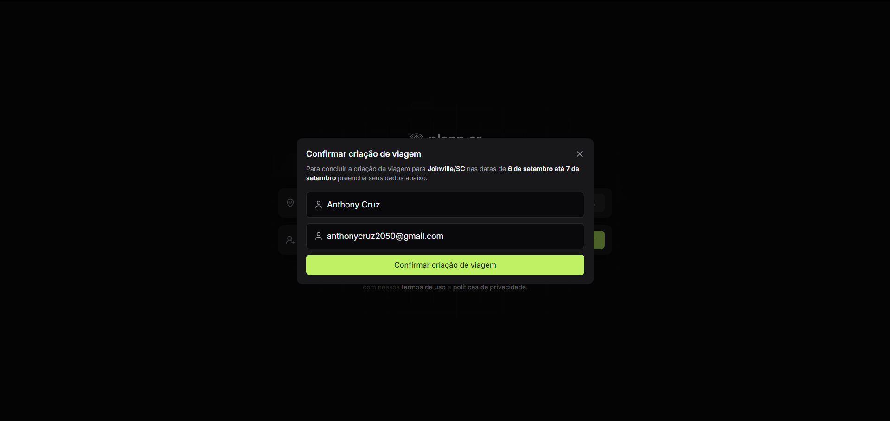
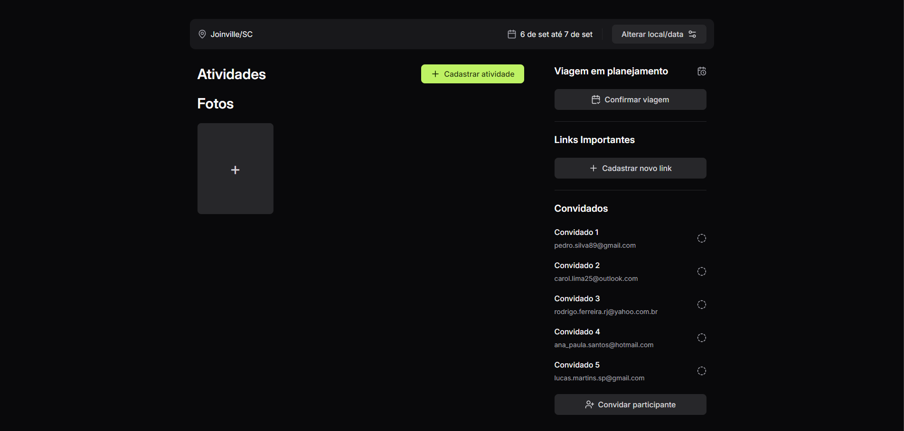
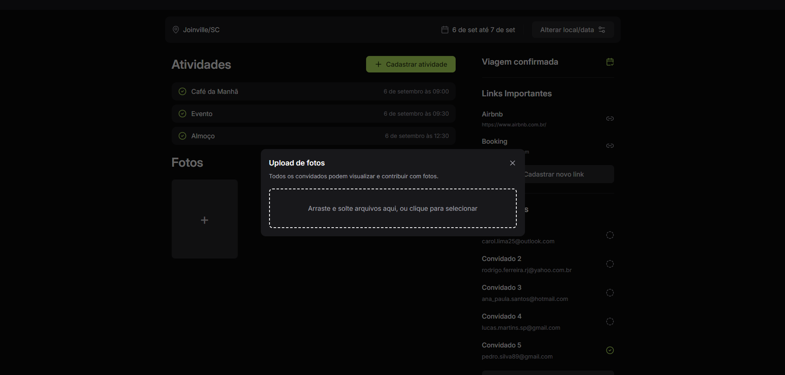
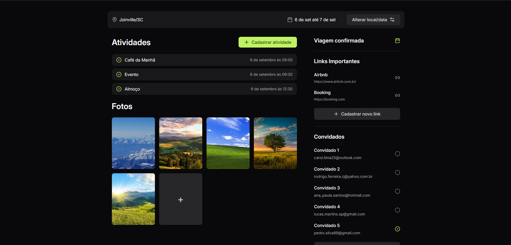

# Planner

Esta aplicação é uma ferramenta que facilita o planejamento e a organização de viagens em grupo. Com ela, é possível criar viagens, adicionar participantes via email, organizar atividades e gerenciar informações importantes como links e fotos relacionadas à viagem. A aplicação serve para ajudar os usuários a centralizarem todos os detalhes de uma viagem, desde o planejamento até a execução, garantindo que todos os envolvidos estejam informados e possam colaborar na organização.

O intuito principal deste projeto era ser focado no backend, visando a criação de uma API sólida e bem estruturada. Por conta disso, o frontend foi mantido como uma parte secundária, sendo criado dentro de uma pasta chamada **frontend** dentro do repositório. Dessa forma, o frontend está presente para complementar o uso das funcionalidades, mas o foco maior do desenvolvimento, das melhorias e dos testes automatizados foi no backend.

O projeto teve seu início inspirado na Next Level Week (NLW) da Rocketseat, onde a base do desenvolvimento foi proposta. No entanto, o backend foi completamente reformulado para atender às necessidades específicas do projeto, sendo redesenhado para garantir maior robustez e flexibilidade. Além disso, novas funcionalidades foram adicionadas, como maior controle sobre as atividades, gestão de links importantes, envio de convites por email e um sistema de upload de fotos com suporte a drag-drop. Essas melhorias tornaram o projeto mais completo e preparado para cenários reais de uso.

## Tecnologias

A aplicação foi desenvolvida utilizando uma combinação robusta de tecnologias modernas. No **backend**, foi utilizado **Spring Boot** para construir uma API escalável e bem estruturada, enquanto o **frontend** foi desenvolvido com **React** para proporcionar uma interface de usuário interativa e responsiva. O projeto foi containerizado com **Docker** e orquestrado com **Docker Compose**, facilitando o gerenciamento e a execução dos serviços em diferentes ambientes. Seguindo **boas práticas** e **design patterns**, a aplicação também conta com testes automatizados utilizando **TestContainers** para gerenciar ambientes de testes isolados e **RestAssured** para validar as funcionalidades da API, garantindo uma cobertura de testes eficiente e a confiabilidade do sistema.

## Execução

Comece clonando o repositório da aplicação para sua máquina local. Abra o terminal e execute o comando:

```bash
git clone <link-do-repositorio>
```

Entre no diretório do projeto clonado:

```bash
cd <nome-do-repositorio>
```

Verifique se o Docker está instalado e funcionando corretamente em sua máquina. Você pode verificar a versão instalada com o seguinte comando:

```bash
docker --version
```

Utilize o Docker Compose para iniciar os serviços necessários. No diretório raiz do projeto, execute:

```bash
docker compose up
```

Isso irá baixar as imagens necessárias (se ainda não estiverem no cache), criar os containers e iniciar os serviços da aplicação.

Após o comando acima, a aplicação estará rodando em seu ambiente local. Acesse o frontend através do navegador utilizando o endereço padrão:

```bash
http://localhost:80 ou apenas http://localhost
```

A API do backend estará disponível em:

```bash
http://localhost:8080
```

Se você deseja testar a API manualmente, importe o arquivo de exemplo para o Insomnia presente no repositório. Isso fornecerá exemplos de requisições e endpoints que a API oferece.


## Frontend

Na tela inicial da aplicação, o usuário é recebido com uma interface intuitiva para iniciar o planejamento de sua viagem. Nesta tela, é possível inserir o destino desejado e selecionar as datas de início e fim da viagem.



Após inserir o destino e as datas da viagem, o próximo passo é adicionar os convidados. O usuário será solicitado a inserir os endereços de email dos participantes desejados. Essa funcionalidade permite que o sistema envie convites automaticamente para todos os convidados, garantindo que todos possam acessar os detalhes da viagem e acompanhar o planejamento de forma colaborativa.



Depois de adicionar os convidados, o próximo passo é o usuário inserir seus próprios dados, como nome e endereço de email. Essas informações são necessárias para identificar o usuário como o organizador da viagem. Como organizador, o usuário terá controle total sobre o planejamento, incluindo a capacidade de gerenciar atividades e atualizações relacionadas à viagem.



Após inserir suas informações e as dos convidados, o usuário será direcionado para a tela de detalhes da viagem. Nesta tela, todas as informações relevantes, como destino e datas da viagem, são exibidas e podem ser ajustadas conforme necessário. Além disso, o usuário pode gerenciar várias aspectos da viagem, incluindo a criação e organização de atividades, a adição e modificação de links importantes, a gestão dos convidados e o upload de fotos da viagem.



O usuário poderá adicionar fotos utilizando um input drag-and-drop. Isso permite que novas fotos sejam arrastadas e soltadas diretamente na área designada da aplicação. Alternativamente, o usuário pode clicar sobre o input para abrir uma janela de seleção de arquivos e escolher imagens armazenadas em seu computador.



Para finalizar, temos uma visão geral completa de uma viagem com todos os campos preenchidos. Nela, você pode ver o destino e as datas da viagem corretamente preenchidos, os participantes confirmados, e a viagem marcada como confirmada.


